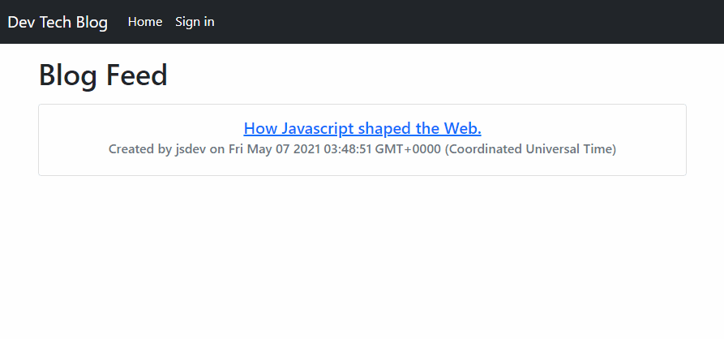

# Technology Blog Application

## Description

This is a CRUD web application that takes the form of a blog website. Users can create and sign into an account, view other people's posts, comment on them, and create their own posts as well. A deployed version of this is on Heroku linked [here](https://tranquil-river-08815.herokuapp.com/).

## Installation

To install this for local testing:

1. Make sure you have [node.js](https://nodejs.dev/) installed on your local machine.
2. Then clone or download the repository. Navigate to the root directory of the copy in your CLI and run the following to install all required dependencies:
```
    npm install
```
3. You will then need to create a MySQL database either through a program such as MySQL Workbench or similar. An `.sql` file to run the query is available in `/db`.
4. You will then need to create and set up a `.env` file with the following information:
```
    DB_NAME=techblog_db
    DB_USER=    // Your MySQL username here (typically root)
    DB_PASS=    // Your MySQL password here
    SECRET=     // A name for the secret variable (can be anything for local testing)
```
5. Now to seed the database with some example data, return to your root directory of the repo, and run:
```
    npm run seeds
```
6. Finally, run the following to start the server:
```
    npm start
```
## Usage

* Click "Sign in" in the navbar to navigate to the sign in page. You can also create an account here (NOTE! You probably shouldn't use your real email, a fake one is fine as long as you remember it.)
* Once logged in, you can click on the dashboard to create, update and delete blog posts.
* You can also comment on blog posts when you click on the post in question on the homepage. After your comment has been created, you can update and delete comments as well.

## Demo

